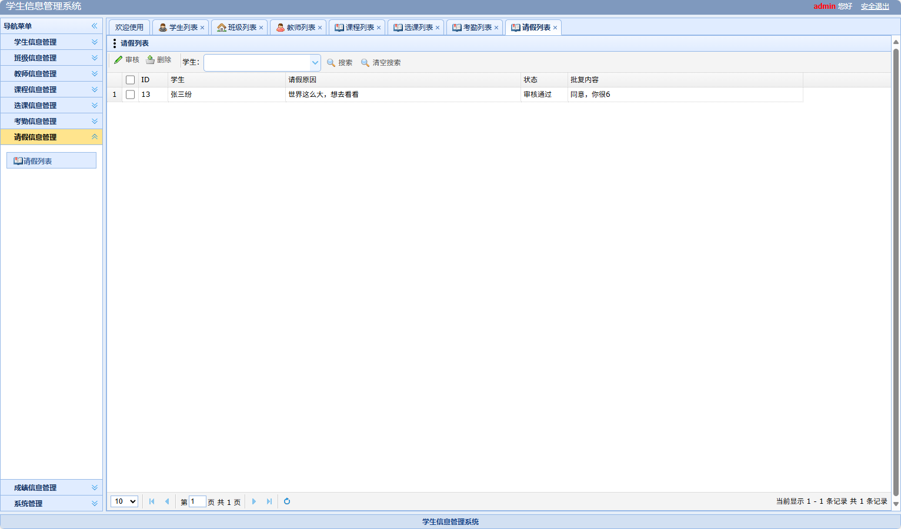
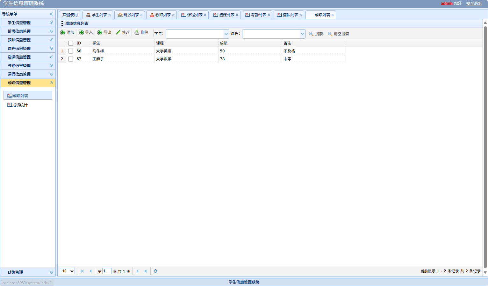

# 学生管理系统(文末免费领取☟)
> 
#### 介绍
学生管理系统(Java_SpringBoot)
有BUG可留言加微

#### 软件架构
Java + SpringBoot + Mybatis + Mysql

#### 项目功能说明

> + 学生信息管理
> + 班级信息管理
> + 教师信息管理
> + 课程信息管理
> + 选课信息管理
> + 考勤信息管理
> + 请假信息管理
> + 成绩信息管理：成绩列表、成绩统计

### 部分功能演示

### 环境需求(可免费提供)
- idea/eclipse、jdk-1.8、maven-3.8.6、mysql、node.js等

## 有项目修改、安装调试需求 请联系以下

## 获取资源扫☝☝☝

